# 🪙 **Golden Turtle**

<div align="center">

</div>

**Golden Turtle** 사용자는 **회원가입 후 ‘시작’ 버튼을 누르면 모의 투자 장에 입장**하게 되며,

**기본 10,000$의 가상 자금**으로 투자를 시작한다.

메인 페이지에서 왼쪽 사이드 바에 있는 시작 버튼을 누르면 Market으로 이동하여 게임이 진행됩니다. 이때 타이머(10분)도 동작됩니다.

종료 버튼을 누르거나 타이머가 종료가 되면 메인페이지로 돌아가면서 결과가 표시가 됩니다.

이후 사용자가 다시 접속하면 **자금은 초기화(다시 10,000$)** 되며, 새로운 모의투자를 시작할 수 있다.

<br>

## 👤 **1. 팀원 소개**


<table style="width: 100%; text-align: center;">
<tr>
<td align="center"> <a href="https://github.com/okok02110211">강성현</a></td>
<td align="center"> <a href="https://github.com/steamjin">김 진</a></td>
<td align="center"> <a href="https://github.com/KyujinPark01">박규진</a></td>
<td align="center"> <a href="https://github.com/Zane-Jeong">정동욱</a></td>
<td align="center"> <a href="https://github.com/405supply">최지원</a></td>
</tr>
<tr>
<td align="center">
    
</td>
<td align="center">
    
</td>
<td align="center">
    
</td>
<td align="center">
    
</td>
<td align="center">
    

</td>
</tr>
</table>


## 📖 **2. 프로젝트 개요**

### 🎯 **소개**
- 10,000달러의 가상 자금으로 참여하는 모의 투자 게임입니다.
- 10분 동안 시장을 분석하고 매매하며, 종료 시 바로 투자 결과를 확인할 수 있습니다.
- 짧은 시간 안에 수익을 극대화하며 실제 투자 감각을 가볍게 경험해보세요.

<br>

### ⭐ **선정 이유**

Golden Turtle은 복잡한 금융 지식이 없어도 누구나 짧은 시간 안에 투자 흐름을 직접 체험하며 ‘실전 투자 감각’을 익힐 수 있도록 기획된 서비스입니다.

최근 주식·코인 시장에 대한 관심과 참여는 빠르게 증가하고 있지만, 실제로 투자 감각을 기르기 위해서는 결국 실전 매매가 필요하고 이는 곧 자본 손실이라는 현실적인 리스크를 동반합니다. 
특히 초보 투자자에게 이러한 진입 장벽은 매우 높게 작용합니다.

Golden Turtle은 이러한 문제의식에서 출발하여, 실제 자금 없이도 리스크 없이, 그러나 실제 시장 구조와 유사한 가격 변동, 주문 흐름, 매매 과정을 경험할 수 있도록 설계되었습니다. 
사용자는 실패에 대한 부담 없이 다양한 전략을 실험하고, 시장의 흐름과 자신의 판단 결과를 체감하며 학습할 수 있습니다.

그 결과 투자 입문자는 안전한 학습 환경에서 기본 감각을 익힐 수 있고, 숙련된 사용자 역시 게임처럼 가볍게 시장 감각을 유지하거나 전략을 검증하는 도구로 활용할 수 있습니다. 
Golden Turtle은 단순한 모의투자를 넘어, 실전에 가까운 경험을 통해 투자 판단력을 키우는 체험형 투자 학습 플랫폼을 지향합니다.

<br>

### 🚀 **주요 기능**
1. **회원 관리**
    - 이메일 기반 회원가입 및 로그인
    - 이메일 인증(6자리 코드), 비밀번호 찾기
    - 마이페이지에서 닉네임 변경 및 비밀번호 변경
    - 로그아웃 및 회원 탈퇴 기능 제공
2. **거래 기록 관리**
    - 보유 종목 조회(내 포트폴리오 확인)
    - 개인 투자 내역 조회(매수/매도 이력 확인)
3. **거래 및 시세 기능**
    - 실시간 시세 기반 매수/매도 기능
    - 종목별 시세 조회
    - 거래 가능 종목 리스트 제공
4. **랭킹 시스템**
    - 전체 이용자 수익률 순위 조회
    - 개인 수익률 및 순위 확인
    - 실시간 반영되는 랭킹 데이터 제공
5. **모의 투자 게임 세션**
    - 기본 가상 자금 10,000달러 자동 지급
    - ‘시작(Start)’ 클릭 시 10분 타이머와 함께 세션 시작
    - 게임 종료 시 즉시 수익 결과 제공 및 메인 페이지로 복귀
    - 재접속 시 자금 자동 초기화로 새로운 모의 투자 시작
    - 투자 중 보유 종목 시가 자동 반영
6. **시세 및 종목 관리**
    - 전체 종목 목록 조회
    - 단일 종목 상세 시세 조회
    - 시세 기반 종목 정보 확인 기능

<br>

## 🕹️ **3. 개발 환경 및 기술 스택**

### 💾 Database & Cache
<p>
    
    
    
</p>

### ⚙️ Backend
<p>
  
  
  
  
  
  
</p>


### 🎨 Frontend
<p>
     
   
  
  
    
</p>

### ☁️ Infrastructure / DevOps
<p>
    
    
    
    
    
</p>

### 📝 Design & Documentation
<p>
    
    
     
</p>


### 🤝  Collaboration      

<p>


</p>

  ## 📁 **4. 프로젝트 구조**

### Backend 폴더 구조

```
src
└── main
    ├── java
    │   └── com
    │       └── team
    │           └── goldenturtle
    │               ├── auth
    │               │   └── 로그인, 회원가입, OAuth2, JWT 인증 등 인증 관련 로직
    │               ├── common
    │               │   ├── config        # 전역 설정(Spring Security, WebConfig 등)
    │               │   ├── dto           # 공통적으로 사용하는 DTO
    │               │   ├── enums         # 프로젝트 공통 Enum 정의
    │               │   ├── exception     # 전역 예외 처리 및 커스텀 예외
    │               │   └── jwt           # JWT 발급/검증 관련 유틸리티
    │               ├── domain            # 핵심 도메인 서비스 계층(비즈니스 로직)
    │               ├── entity            # DB 엔티티 및 매핑 객체
    │               ├── gamesession       # 게임 세션 생성, 종료, 타이머 로직
    │               ├── ranking           # 사용자 수익률 기반 랭킹 계산 및 제공
    │               ├── repo              # Mapper 인터페이스(MyBatis Repository)
    │               ├── stockinfo         # 주가 API 연동 및 종목 정보 관리
    │               ├── trade             # 매수/매도 로직, 거래 기록 처리
    │               ├── user              # 사용자 정보 관리(User 서비스·컨트롤러)
    │               ├── websocket         # 실시간 주가/게임 진행 WebSocket 통신 처리
    │               └── GoldenTurtleApplication.java   # Spring Boot 메인 실행 파일
    │
    └── resources
        ├── mappers          # MyBatis Mapper XML 파일 모음
        └── application.yml  # 환경 설정(Application Profile, DB/Redis 설정)

```
### Frontend 폴더 구조

```
Golden-Turtle-Frontend
├── public
│
├── src
│   ├── api                 # API 통신 로직 (Axios, API 모듈)
│   │
│   ├── assets              # 정적 리소스 (이미지, 아이콘 등)
│   │   ├── header
│   │   ├── main
│   │   ├── sidebar
│   │   └── stock
│   │
│   ├── components          # 컴포넌트
│   │   ├── auth             # 로그인, 회원가입 등 인증 관련 컴포넌트
│   │   ├── common           # 공통 UI 컴포넌트
│   │   ├── layout           # 레이아웃 관련 컴포넌트
│   │   ├── modal            # 모달 컴포넌트
│   │   ├── mypage           # 마이페이지 관련 컴포넌트
│   │   ├── stock            # 주식/자산 관련 컴포넌트
│   │   └── trade            # 거래 관련 컴포넌트
│   │
│   ├── layouts              # 페이지 레이아웃 정의
│   ├── pages                # 페이지 단위 컴포넌트
│   ├── router               # Vue Router 설정
│   ├── stores               # Pinia 상태 관리
│   ├── views                # 라우팅 대상 View 컴포넌트
│   │
│   ├── App.vue              # Root 컴포넌트
│   └── main.js              # 앱 진입점
│
├── .env                     # 환경 변수
├── .gitignore
├── index.html
├── jsconfig.json
├── package.json
├── package-lock.json
├── vite.config.js
└── README.md

```


<br>

## 📅 **5. 프로젝트 기획**

### 1. **WBS**

<details> 
<summary> WBS 이미지</summary>

</details>
<br>

### 2. **요구사항 명세서**

<details> 
<summary> 요구사항 명세서 이미지</summary>
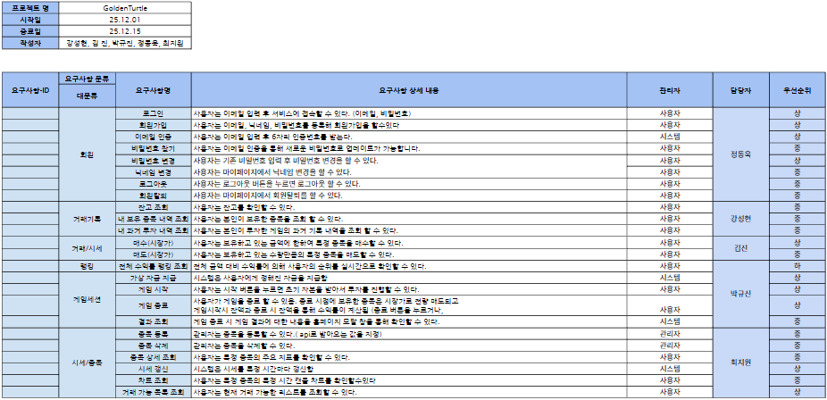
</details>
<br>

### 3. **DB 모델링**

<details> 
<summary> ERD 이미지</summary>
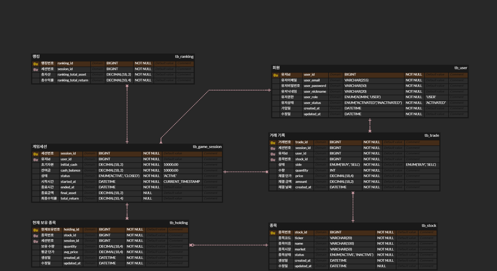
</details>

<br>

### 4. **API 명세서**
<details> 
<summary> Swaqqer UI 이미지 </summary>
    
    
    
</details>

### 5. **FIGMA**
FIGMA 바로가기 [여기](https://www.figma.com/design/mEtAMkg9PCEV5wRXPM7Ogq/GOLD?node-id=0-1&t=U5aUd94NJQIHN4xX-1)에서 확인하실 수 있습니다.


<br>

## ⏳ **6. 사용자 흐름 **

### **API GIF**

<details>
<summary> GIF </summary>
    
회원가입
    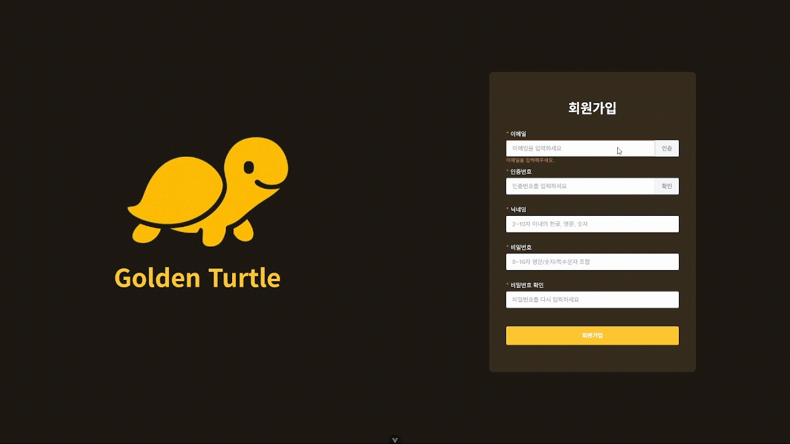

비밀번호 찾기
    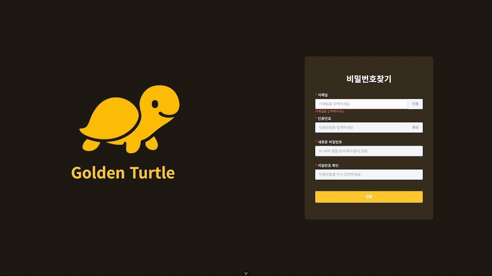

로그인
    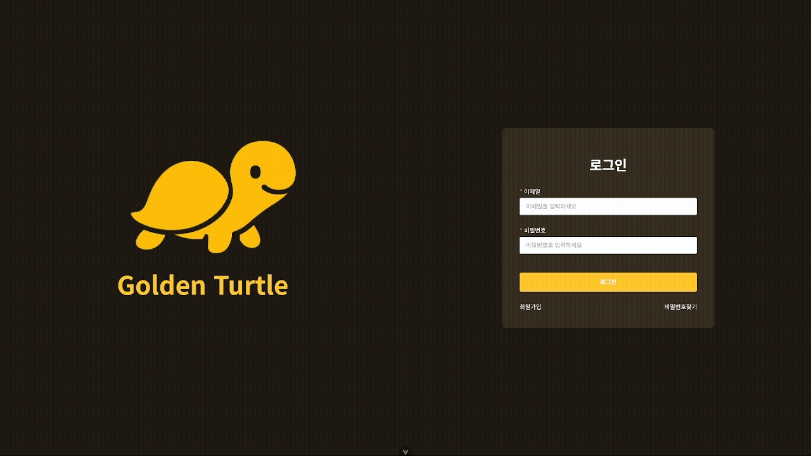

마이페이지
    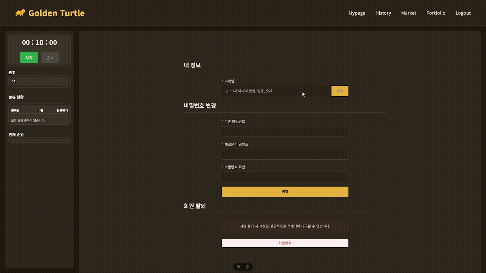

게임 시작 후 매수 및 매도 후 종료
    

게임 진행 중 나의 포토폴리오 조회
    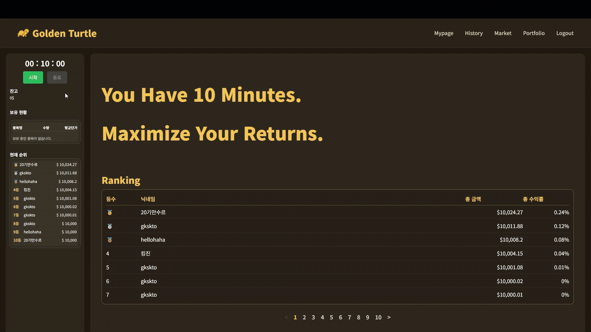

게임 진행 후 나의 과거 기록 조회
    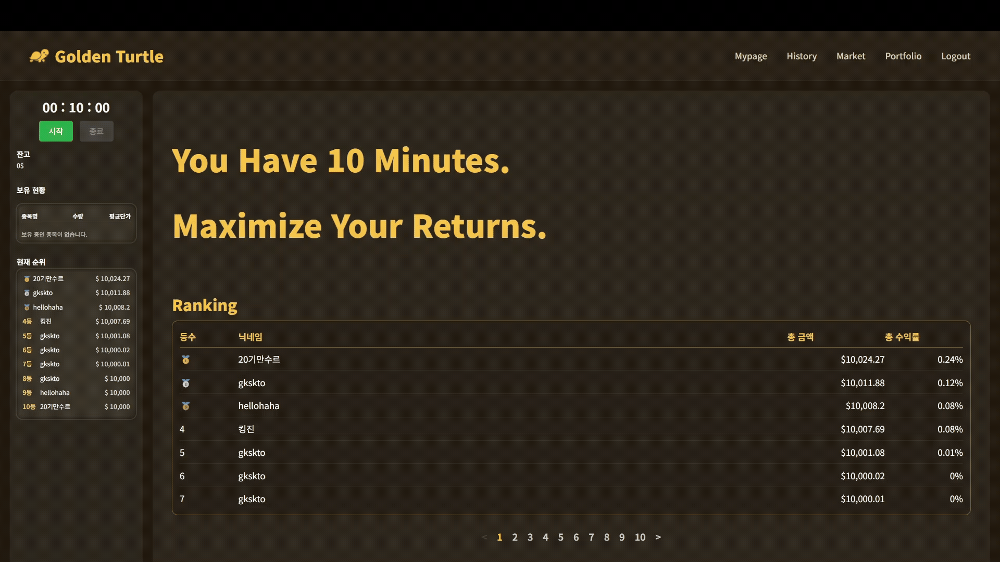

관리자페이지 (종목추가)
    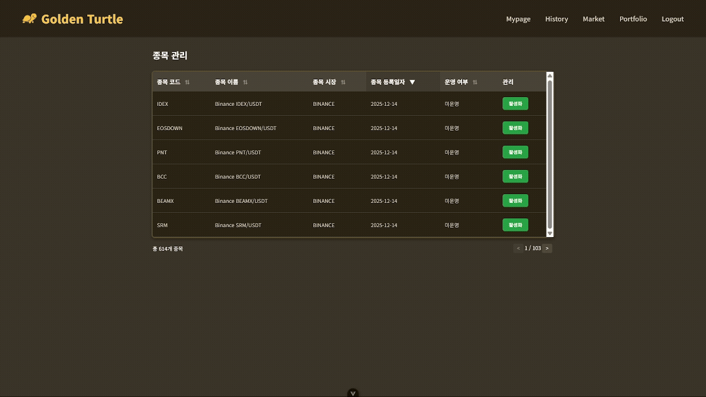

로그아웃
    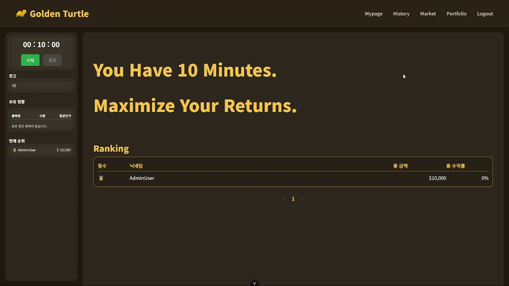


    
</details>

### **GUIDE URL**

GUMMA PPT 바로가기 [여기](https://gamma.app/docs/-cqgiskvr2jkfztx)에서 확인하실 수 있습니다.


## ⚙️ **7. CI/CD 구축 및 배포 자동화**

🛜 CI/CD 프로젝트 아키텍처
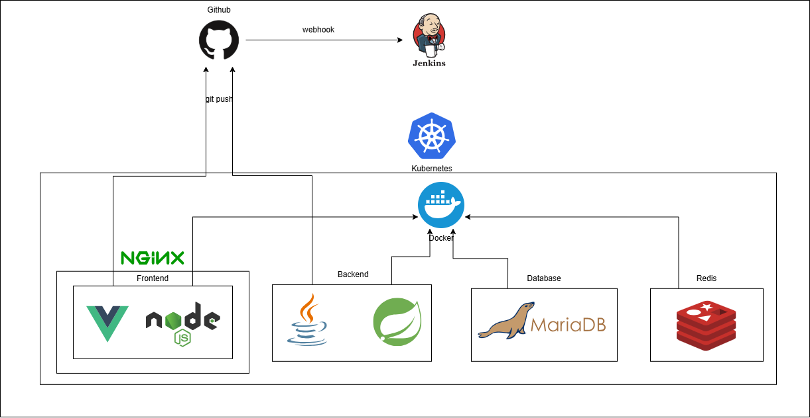


📱 CI/CD 테스트


## ⚠️ **8. 트러블 슈팅**

<details>
<summary> 강성현 </summary>

    ## 트러블슈팅: Alpine(musl) 런타임에서 netty-quiche(HTTP/3, QUIC) 네이티브 로드 실패
    
    ### 1) 현상
    
    - 컨테이너 실행 시 애플리케이션이 기동 중/기동 직후 종료됨
    - 로그에 다음과 같은 형태의 에러가 등장:
        - `ld-linux-x86-64.so.2: not found`
        - Netty native library / `netty-quiche` 로딩 실패 관련 메시지
    - 결과적으로 HTTP/3(QUIC) 관련 기능 초기화 과정에서 실패하며 전체 프로세스가 죽을 수 있음
    
    ### 2) 원인
    
    - Dockerfile의 **런타임 베이스 이미지가 Alpine Linux**였음
    - Alpine은 기본 C 라이브러리가 **musl** 기반인데,
    - `netty-quiche`가 로드하려는 네이티브 바이너리는 **glibc 로더(`ld-linux-x86-64.so.2`)를 전제로** 빌드된 경우가 많음
    - 따라서 Alpine에는 glibc 로더가 없어서 네이티브 라이브러리 로딩이 실패 → 애플리케이션 종료로 이어짐
    
    ### 3) 핵심 판단 포인트
    
    - “왜 `ld-linux-x86-64.so.2` 를 찾냐?”
        
        → 해당 네이티브 라이브러리가 **glibc 환경에서 실행되는 ELF 바이너리**이기 때문
        
    - “왜 Alpine에서만 터지냐?”
        
        → Alpine은 glibc가 기본이 아니라 **musl**이라서, glibc 로더 파일 자체가 없음
        
    
    ### 4) 해결 방법 (우선순위 1)
    
    **런타임 이미지를 Alpine → Debian/Ubuntu(glibc) 기반으로 변경**
    
    - 예: `eclipse-temurin:17-jre`, `eclipse-temurin:21-jre`, `amazoncorretto`, `debian:bookworm-slim` 기반 JRE 등
    
</details>

<details>
<summary> 김 진 </summary>

    ### 실시간 주가 Provider 분리

    **문제**
    
    - FinnhubClientHandler가 WebSocket 통신과 실시간 주가 저장을 동시에 담당
    - 거래 서비스가 현재가 조회를 위해 Handler에 직접 의존
    
    **원인**
    
    - 단일 책임 원칙 위반
    - 강한 결합으로 테스트·확장성 저하
    
    **해결**
    
    - 실시간 주가 관리 책임을 `RealtimeStockPriceProvider`로 분리
        - FinnhubClientHandler: 통신 전담
        - Provider: 주가 저장·조회 전담
    
    **결과**
    
    - 의존성 단순화
    - 테스트 용이성 및 확장성 개선
    - 기존 로직 이동만으로 구조 개선 완료
    
</details>

<details>
<summary> 정동욱 </summary>

    문제 : 엑세스 토큰 재발급이 정상적으로 이루어지지 않았음 기존 로직에서는 401에러가 뜨면 엑세스 토큰을 발급하게 했었는데 403 에러가 발생하는 경우도 있어서 엑세스 토큰 재발급이 정상저긍로 이루어지지 않았습니다.
    해결 : 403이라는 예외가 발생한 경우 엑세스 토큰이 재발급하게 수정을 하여 적요
    보안 : 해당 방법은 적절한 조취가 아니라는 것을 깨달아서 추후 엑세스 토큰이 만료가 되면 401 에러가 발생하여 발급하는 로직으로 코드를 수정
    
</details>

## 🌇 **9. 프로젝트 종료 후 느낀점**

<details>
<summary> 강성현 </summary>

    devops 프로젝트를 하면서 확실히 유지보수가 가능한 구조의 프로젝트의 중요성을 깨달은것같다.  
    쿠버네티스를 진행하면서 단일화 되지 않은 컨벤션을 나중에 수정하게 될수록 더 많은 비용이 들어간다는걸 느꼈고, 
    큰회사에서 사용하는 기술일수록 더욱 더 유지보수 가 가능하도록 설계해야한다는걸 느꼈다
    
</details>

<details>
<summary> 김 진 </summary>

    기존에 진행해왔던 프로젝트들에 비해 개발 기간이 짧아 초반에는 다소 부담과 걱정이 있었다. 
    그러나 그동안의 프로젝트 경험을 되짚으며, 세부 구현에 앞서 전체적인 개발 흐름과 구조를 이해하는 데 집중하려 노력했다. 
    그 과정에서 짧은 기간 안에서도 핵심을 파악하고 방향을 잡는 것이 중요하다는 점을 다시 한 번 느끼게 되었다.
    또한 GitHub의 이슈, 브랜치, PR을 체계적으로 관리하는 것이 협업 과정에서 작업 흐름을 명확히 하고 효율을 높이는 데 큰 역할을 한다는 점을 실감했다. 
    전체 기능이 어느 정도 완성된 이후에야 내가 맡은 기능을 안정적으로 구현할 수 있었기 때문에,
    기능을 병합하는 과정에서 반복적으로 소통이 필요했고 그만큼 협업에서의 커뮤니케이션 중요성을 더욱 크게 느꼈다.
    이번 경험을 통해 단순히 개인 개발 역량뿐만 아니라, 팀 단위로 일할 때의 협업 방식과 소통 구조가 프로젝트 완성도에 직결된다는 점을 배웠다. 
    다음 프로젝트에서는 초반부터 협업 방식을 보다 체계적으로 정리하고, 역할과 흐름을 명확히 한 상태에서 프로젝트에 임하고 싶다.

</details>

<details>
<summary> 정동욱 </summary>
    
    ### 담당 영역

    본 프로젝트에서 **인증(Authentication)·인가(Authorization)** 및 **사용자 계정 관리** 전반을 담당하였다.

    JWT 기반 인증 구조를 설계하고, Access Token과 Refresh Token을 분리하여 인증 상태를 관리하는 구조를 구현하였다. 또한 회원가입, 로그인, 비밀번호 변경 및 인증 기반 비밀번호 재설정 기능을 구현하였다.

    ---

    ### 진행하며 느낀 점

    인증 로직을 직접 구현하면서 실제 웹 서비스에서 로그인과 세션 관리가 어떻게 동작하는지 전반적인 흐름을 이해할 수 있었다. 
    단순히 “로그인 기능”이 아니라, 토큰 발급·검증·만료·재발급까지 이어지는 인증 사이클을 경험할 수 있었던 점이 인상 깊었다. 
    이 과정은 프로젝트 내에서 가장 흥미롭고 몰입도가 높은 작업이었다.

    ---

    ### 아쉬웠던 점

    프로젝트 기간이 비교적 짧아, **보안 측면에서 더 다양한 설계 방안과 사례를 충분히 조사하지 못한 점**이 아쉬움으로 남는다.

    특히 가장 아쉬웠던 부분은 **Access Token 재발급 로직의 설계 방식**이었다.

    현재 프로젝트에서는 Access Token이 만료된 상태에서 다른 API를 호출할 경우 오류가 발생하고, 
    해당 오류(401 또는 403)를 기준으로 Refresh Token을 조회하여 Access Token을 재발급하는 구조로 설계하였다. 
    프로젝트 진행 당시에는 자연스럽다고 판단했으나, 
    후반부에 이 구조가 인증 흐름 측면에서 비효율적이고 혼란을 줄 수 있다는 점을 인지하게 되었다.

    ---

    ### 개선 방향 및 다음 목표

    추후 프로젝트에서는 다음과 같은 방향으로 로직을 개선할 계획이다.

    - Access Token 만료 시 **401 Unauthorized 에러를 명확한 기준으로 사용**
    - 클라이언트에서 401 응답을 감지하면, 별도의 재발급 API를 통해 Refresh Token 기반 Access Token 재발급 수행
    - 일반 비즈니스 API와 토큰 재발급 로직을 명확히 분리하여 인증 흐름을 단순화

    이번 프로젝트를 통해 “동작하는 코드”와 “잘 설계된 인증 구조” 사이의 차이를 체감할 수 있었고, 
    다음 프로젝트에서는 보안과 구조적 완성도를 더욱 고려한 인증 시스템을 구현하는 것을 목표로 하고 있다.
    
</details>

<details>
<summary> 박규진 </summary>
    
    데브옵스 프로젝트를 진행하며 해당 분야에 대한 사전 학습이 충분하지 않았다는 점에서 팀원들에게 미안함을 느꼈다. 
    최종 프로젝트를 앞둔 마지막 프로젝트였기에 최대한 열심히 하려고 노력했지만 소통 측면에서는 
    개인적으로는 괜찮다고 생각했던 부분이 팀원들 입장에서는 아쉬움으로 남았을 수도 있겠다는 생각이 들었다. 
    이 경험을 통해 최종 프로젝트에서는 기술적인 준비 뿐만 아니라 체계적인 문서화와 함께 팀원들과 보다 적극적으로 소통해야겠다고 느꼈다.
    
</details>
<details>
<summary> 최지원 </summary>

    Websocket 기반 실시간 통신을 아직 해보지 않아 아쉬운 마음이 컷는데, 이번 프로젝트에서 해당 부분을 전담하여 개발을 이어나가 기술적 성취도가 있었습니다.
    또한 평소에 만들어보고 싶었던 것들 중 하나를 실제로 만들 수 있게 되어 즐기면서 구현할 수 있었습니다.
    추가로 새로운 팀원분들과 합을 맞추면서 소통과 협업 방법론에 대해서 다시 한번 더 생각해보는 계기가 되었습니다.
    
</details>


